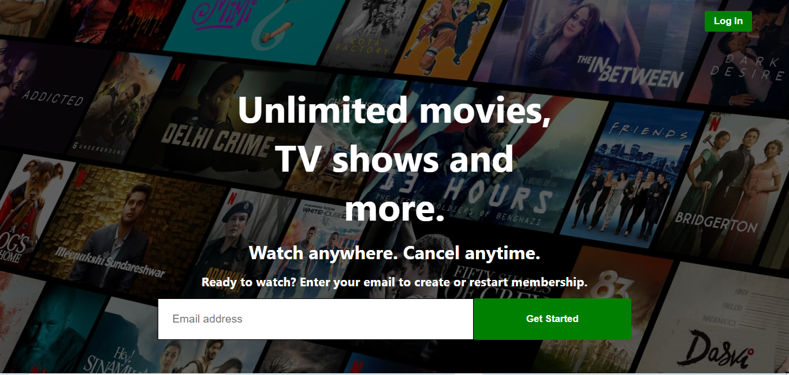
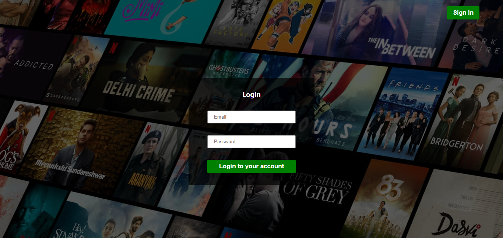
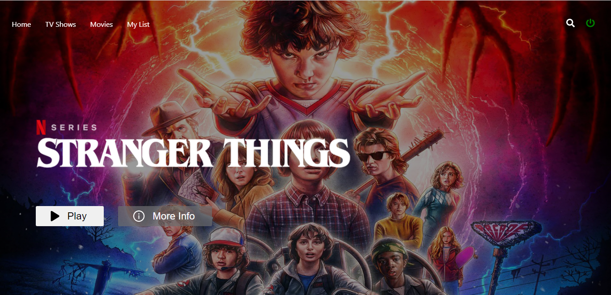
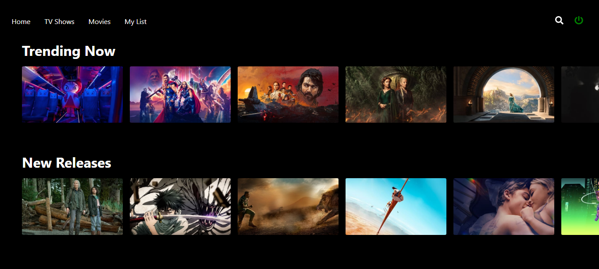
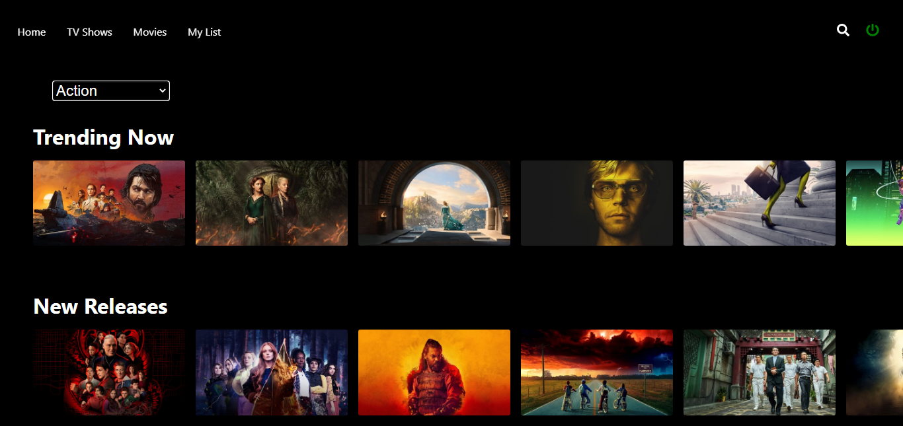
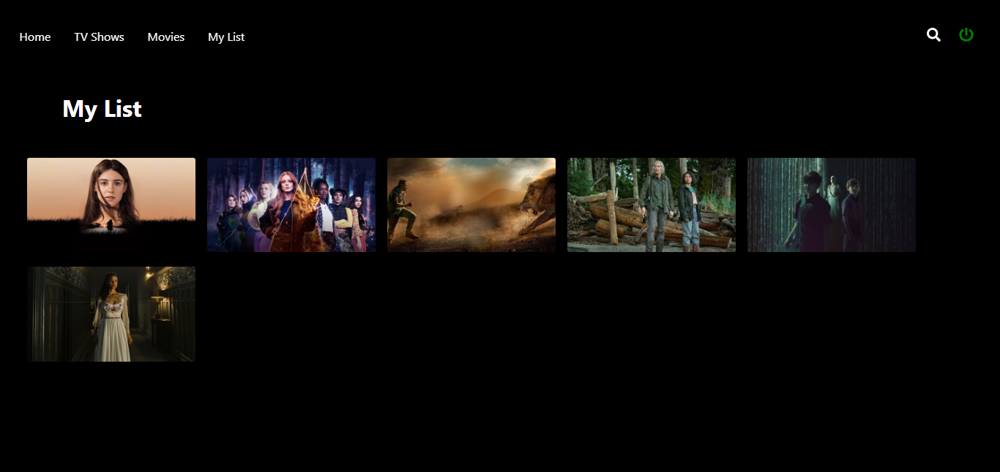

# Movie-App

### The project is based on a movie streaming platform. The project facilities you to watch the movie trailer. 
### It fetches movies' names, posters, and the category of the movie from the TMDB API services(Movies database).


## Technology used

### Frontend :- HTML, CSS, Javascript

### Backend :- Nodejs, Express(server), MongoDB(Database)

## Installation

Install my-project with npm

```bash
  npm install my-project
  cd my-project
```
    

## Run Locally

Clone the project

```bash
  git clone https://github.com/priyanshugupta9329/Movie-App.git
```

### Frontend

Go to the project directory

```bash
  cd my-project
```

Install dependencies

```bash
  npm install
```

Start the server

```bash
  npm run start
```


### Backend

Go to the project directory

```bash
  cd my-project
```

Install dependencies

```bash
  npm install
```

Start the server

```bash
  npm run start
```


## Link

- [https://movie-trailer-app9329.herokuapp.com/](https://movie-trailer-app9329.herokuapp.com/)

# Screenshots









